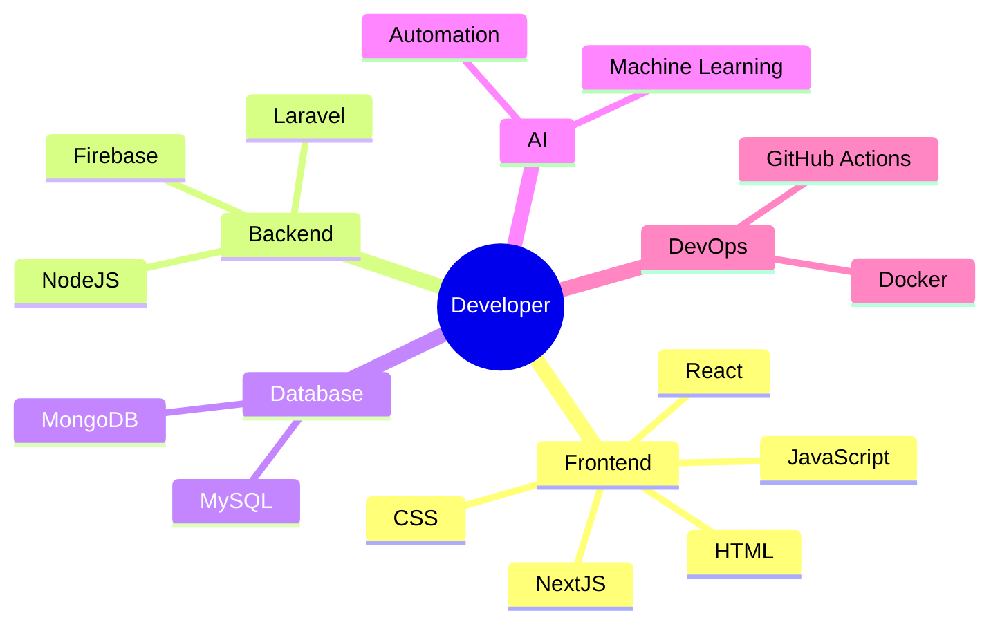

<div align="center">


#  Hello World, I'm Dimas


<br>


</div>

---

# 🌌 Welcome

```text
██████╗ ██╗███╗   ███╗ █████╗ ███████╗
██╔══██╗██║████╗ ████║██╔══██╗██╔════╝
██║  ██║██║██╔████╔██║███████║███████╗
██║  ██║██║██║╚██╔╝██║██╔══██║╚════██║
██████╔╝██║██║ ╚═╝ ██║██║  ██║███████║
╚═════╝ ╚═╝╚═╝     ╚═╝╚═╝  ╚═╝╚══════╝
```

> ## 🚀 "The future belongs to those who never stop learning."

---

# 💫 About Me

<p align="center">
  
</p>


```javascript
class Developer {
  constructor() {
    this.name = "Dimas Dwi Syah";
    this.username = "DimassDwiiorg";
    this.country = "Indonesia 🇮🇩";
    this.role = "Full Stack Developer";

    this.language = [
      "Indonesia",
      "English"
    ];

    this.currentlyLearning = [
      "Next.js",
      "React",
      "Laravel",
      "Node.js",
      "AI Engineering",
      "TailwindCSS"
    ];

    this.interests = [
      "Web Development",
      "Artificial Intelligence",
      "Automation",
      "Open Source",
      "UI/UX Design"
    ];
  }
}

export default Developer;
```

---

# 🚀 Current Mission

- 🔥 Building useful projects every week.
- 🌱 Learning something new every single day.
- 💙 Contributing to Open Source.
- 🚀 Creating software that solves real problems.
- 🤝 Looking for collaborations with amazing developers.
- 🎯 Becoming a better developer than yesterday.

---

# ⚡ Developer Philosophy

> "Consistency beats talent when talent doesn't stay consistent."

> "Every expert was once a beginner."

> "One commit today is better than zero commits tomorrow."

> "Small progress is still progress."

---

# 🧠 Daily Mindset

```text
Wake Up
   │
   ▼
Drink Coffee ☕
   │
   ▼
Write Code 💻
   │
   ▼
Fix Bugs 🐞
   │
   ▼
Learn Something New 📚
   │
   ▼
Push To GitHub 🚀
   │
   ▼
Repeat 🔁
```

---

# 🌍 Connect With Me

<p align="center">

<a href="mailto:dimassdwisyah@gmail.com">

</a>

<a href="https://github.com/DimassDwiiorg">

</a>

</p>

---

<div align="center">

## ⭐ Thank You For Visiting

### "Don't chase success.

### Build value.

### Success will follow."

</div>

---

# ⚡ Tech Arsenal

<div align="center">

### 🚀 Languages

<p>

</p>

### 🎨 Frontend

<p>

</p>

### ⚙ Backend

<p>

</p>

### 🗄 Database

<p>

</p>

### ☁ Cloud & DevOps

<p>

</p>

### 🛠 Tools

<p>

</p>

</div>

---

# 📊 GitHub Dashboard

<div align="center">


</div>

<br>

<div align="center">


</div>

---

# 📈 Contribution Graph

<div align="center">


</div>

---

# 🏆 GitHub Achievements

<div align="center">


</div>

---

# 💻 Coding Status

<div align="center">

| Status | Progress |
|---------|----------|
| ☕ Coffee | ██████████ 100% |
| 💻 Coding | █████████░ 95% |
| 🐞 Bug Fixing | ████████░░ 80% |
| 📚 Learning | ██████████ 100% |
| 🚀 Deploying | █████████░ 90% |
| 🤝 Collaboration | ████████░░ 85% |

</div>

---

# 📅 Weekly Developer Schedule

```text
Monday      ████████████
Tuesday     ███████████
Wednesday   █████████████
Thursday    ███████████
Friday      █████████████
Saturday    ████████
Sunday      ██████
```

---

# 🚀 Developer Levels

```text
HTML        ███████████████████ 100%

CSS         █████████████████░░ 95%

JavaScript  ████████████████░░░ 90%

React       ████████████░░░░░░░ 70%

NodeJS      ███████████░░░░░░░░ 65%

Laravel     ████████████░░░░░░░ 75%

Python      █████████░░░░░░░░░░ 60%

AI          ███████░░░░░░░░░░░░ 45%
```

---

# 🎯 Goals 2026

- ✅ Build 20+ Open Source Projects
- ✅ Learn AI Development
- ✅ Master Full Stack Engineering
- ✅ Reach 1,000 GitHub Followers
- ✅ Contribute to Global Open Source
- ✅ Launch Personal Portfolio
- ✅ Build SaaS Products
- ✅ Help Other Developers Grow

---

# 🌟 Quote of the Day

> **"Success isn't built in one giant leap. It's built in thousands of tiny commits."**

---

<div align="center">

### 🚀 Every Commit Matters

*"Your GitHub profile is more than a collection of repositories. It's a story of your growth as a developer."*

</div>

---

# 🚀 Featured Projects

<div align="center">

| 🚀 Project | Description | Status |
|------------|------------|--------|
| 🌸 NexaNime | Modern Anime Streaming Platform | 🚧 In Development |
| ☕ Jual Beli akun | Websites That Provide Game Account Buying and Selling Services | 🚧 In Development |
| 🤖 NexaAi | Ai who can be asked anything | 🚧 Maintenance |
| 🌐 Personal Portfolio | My Introduction Website | 🔥 Active |

</div>

---

# 🌟 Open Source Journey

```text
2024  ██████████ Started Learning Programming

2025  ███████████████████ First Real Projects

2026  █████████████████████████ Building Open Source

2027  █████████████████████████████ Future Goals...
```

---

# 🧠 Developer Mind



---

# 💻 Coding Philosophy

> Write code that your future self will thank you for.

> Learning never stops.

> Consistency creates excellence.

> Every bug is another lesson.

---

# 📊 GitHub Summary

<div align="center">


<br><br>


</div>

---

# 📈 Productivity

```text
Code ████████████████████ 100%

Learning ████████████████░ 90%

Debugging ███████████████░ 85%

Coffee ██████████████████ 100%

Creativity ███████████████ 90%
```

---

# 💡 Random Motivation

> "The expert in anything was once a beginner."

> "Code. Learn. Repeat."

> "The only impossible project is the one you never start."

> "Never compare your Chapter 1 with someone else's Chapter 20."

---

# 🌍 My Dream

✔ Build useful software

✔ Help people through technology

✔ Inspire beginner developers

✔ Become an Open Source Contributor

✔ Learn Artificial Intelligence

✔ Build products used worldwide

---

# 💬 Favorite Quote

<div align="center">

# "Discipline is choosing between what you want now and what you want most."

</div>

---

# ❤️ Thanks For Visiting

<div align="center">

If you like my projects,

consider leaving a ⭐.

It motivates me to build even better software.

</div>

---

# 🐍 Contribution Snake

<div align="center">

> ⚠️ Aktif setelah GitHub Actions dikonfigurasi.

<picture>
  <source media="(prefers-color-scheme: dark)" srcset="https://raw.githubusercontent.com/DimassDwiiorg/DimassDwiiorg/output/github-contribution-grid-snake-dark.svg">
  <source media="(prefers-color-scheme: light)" srcset="https://raw.githubusercontent.com/DimassDwiiorg/DimassDwiiorg/output/github-contribution-grid-snake.svg">
  
</picture>

</div>

---

# 🌟 My Coding Journey

```text
🌱 Learn
      │
      ▼
💡 Practice
      │
      ▼
💻 Build
      │
      ▼
🐞 Debug
      │
      ▼
🚀 Deploy
      │
      ▼
⭐ Inspire Others
```

---

# 💼 Current Focus

- 🌐 Building **NexaNime**
- 🤖 Developing **SAMZZ BOT**
- 📚 Learning **Artificial Intelligence**
- 🚀 Improving **Full Stack Development**
- 💙 Contributing to Open Source

---

# 🎯 2026 Mission

```text
[██████████░░░░░░░░] Build Powerful Projects

[█████████████░░░░░] Master Full Stack

[████████░░░░░░░░░░] Learn AI & Automation

[████████████░░░░░░] Grow Open Source

[███████████░░░░░░░] Help Beginner Developers
```

---

# 💡 Words That Drive Me

<div align="center">

### 💭 "Great developers aren't born. They are built one commit at a time."

### 🚀 "Dream big. Start small. Stay consistent."

### 🔥 "Every bug you fix makes you stronger."

### ⭐ "Don't wait for opportunities. Build them."

</div>

---

# 📬 Let's Connect

<div align="center">

<a href="https://github.com/DimassDwiiorg">

</a>

<a href="mailto:dimassdwisyah@gmail.com">

</a>

</div>

---

<div align="center">

## ⭐ Thanks for stopping by!


### 🚀 *"The best way to predict the future is to create it."*

**Happy Coding! 💙**

</div>
